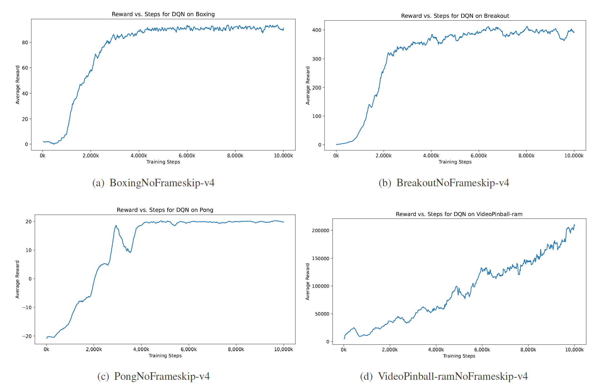
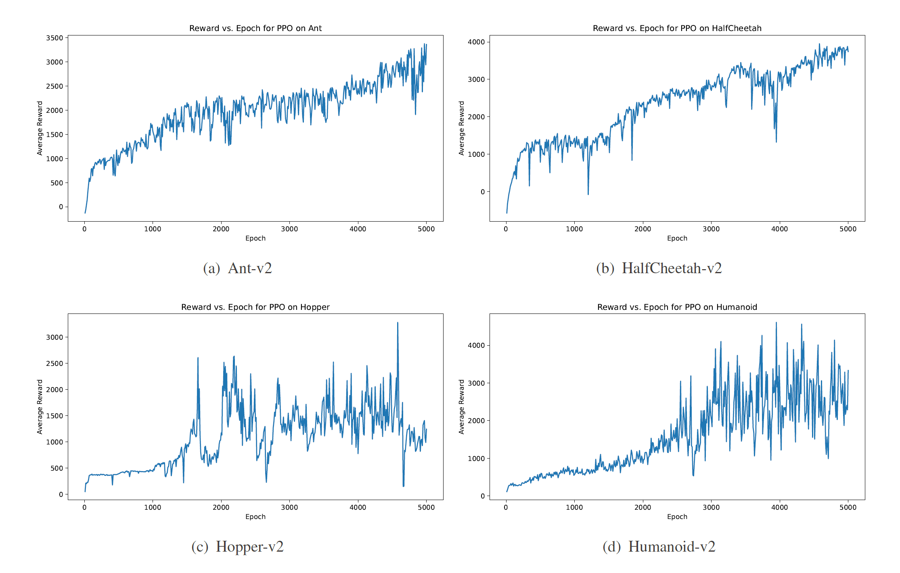
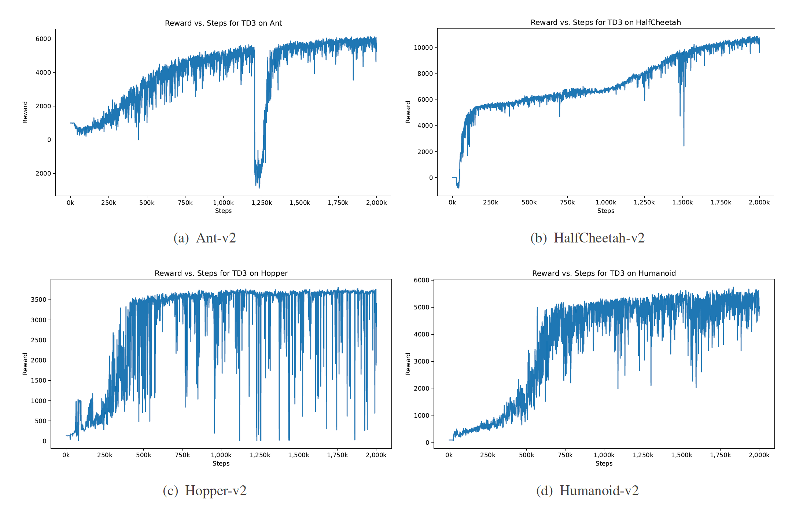

# CS7309_RL_Project

## Overview

这是强化学习理论与算法Final Project仓库。本次项目在Atari和MuJoco环境中分别使用了value-based 和 policy-based算法进行测试。具体地，对于Atari环境，使用DQN算法分别对Boxing, Breakout, VideoPinball, 和Pong进行了测试。对于MuJoco环境，使用PPO和TD3算法分别对Ant,
HalfCheetah, Hopper, 和Humanoid进行了测试。

## Environment Setup

***该项目环境配置仅在Ubuntu上得到验证***

首先创建conda环境，并安装PyTorch，得益于PyTorch的高版本兼容性，本次实验使用最新版Torch环境
```shell
conda create -n RL_3.9 python=3.9
conda activate RL_3.9
pip install torch torchvision # pip install torch==2.1.2 torchvision==0.16.2
```

然后安装gym环境，由于不同版本间API差距较大，本次实验使用`gym==0.21.0`
```shell
pip install gym==0.21.0
pip install ale_py==0.7.5
```
如果遇到安装问题，可以参考Troubleshooting部分。

然后执行以下脚本安装剩余依赖文件,
```shell
pip install -r requirements.txt
```

## File Structure
本仓库所有文件结构和功能如下图所示：
```shell
├── modules                                             # 本次实验使用到的模块
│   ├── dqn                                             # 模型文件夹
│   │   ├── wrapper                                     # atari平台封装
│   │   │   ├── atari_wrapper.py
│   │   │   └── monitor.py                                                                             
│   │   ├── agent.py                                    # 算法策略的代码实现
│   │   ├── model.py                                    # 算法使用的神经网络模型定义
│   │   └── trainer.py                                  # 算法的训练超参数以及训练主函数
│   ├── ppo
│   └── td3
├── results                                             # 结果文件夹
│   ├── DQN
│   │   ├── BoxingNoFrameskip-v4
│   │   │   ├── checkpoints                             # 模型文件
│   │   │   ├── hyper_params.json                       # 实验超参数
│   │   │   ├── log.txt                                 # 实验部分关键输出
│   │   │   └── Reward_DQN_BoxingNoFrameskip-v4.pdf     # 实验回报曲线图
│   │   └── ...
│   ├── PPO
│   └── TD3
├── slurm_logs                                          # slurm日志
├── README.md                                           # 本文件
├── requirements.txt                                    # pip包列表
├── run.py                                              # 实验主程序
├── run.sbatch                                          # slurm脚本示例
├── run.sh                                              # shell脚本示例
└── LICENSE
```

## Run Experiments
使用下列指令以进行测试，所有结果将自动保存在`results`文件夹下，我们使用`argparse`库对参数进行了封装，可以通过`python run.py -h`查看所有可用参数，请注意并非所有参数对所有算法都有效。
```shell
conda activate RL_3.9

python run.py --model DQN --env_name BoxingNoFrameskip-v4 --num_steps 10000000 --n_envs 16
python run.py --model DQN --env_name BreakoutNoFrameskip-v4 --num_steps 10000000 --n_envs 16
python run.py --model DQN --env_name PongNoFrameskip-v4 --num_steps 10000000 --n_envs 16
python run.py --model DQN --env_name VideoPinball-ramNoFrameskip-v4 --num_steps 10000000 --n_envs 16

python run.py --model PPO --env_name Ant-v2 --epoch 5000 --n_envs 16
python run.py --model PPO --env_name HalfCheetah-v2 --epoch 5000 --n_envs 16
python run.py --model PPO --env_name Hopper-v2 --epoch 5000 --n_envs 16
python run.py --model PPO --env_name Humanoid-v2 --epoch 5000 --n_envs 16

python run.py --model TD3 --env_name Ant-v2 --num_steps 2000000 --n_envs 16
python run.py --model TD3 --env_name HalfCheetah-v2 --num_steps 2000000 --n_envs 16
python run.py --model TD3 --env_name Hopper-v2 --num_steps 2000000 --n_envs 16
python run.py --model TD3 --env_name Humanoid-v2 --num_steps 2000000 --n_envs 16
```

## Experiment Results

实验结果展示如下

### DQN



### PPO



### TD3



## Troubleshooting

### 1. gym安装问题
安装时如果遇到以下问题
```shell
Collecting gym==0.21.0
  Using cached gym-0.21.0.tar.gz (1.5 MB)
  Preparing metadata (setup.py) ... error
  error: subprocess-exited-with-error
 
  × python setup.py egg_info did not run successfully.
  │ exit code: 1
  ╰─> [1 lines of output]
      error in gym setup command: 'extras_require' must be a dictionary whose values are strings or lists of strings containing valid project/version requirement specifiers.
      [end of output]
 
  note: This error originates from a subprocess, and is likely not a problem with pip.
error: metadata-generation-failed
 
× Encountered error while generating package metadata.
╰─> See above for output.
 
note: This is an issue with the package mentioned above, not pip.
hint: See above for details.
```

则需要升级`setuptools`和`wheel`版本
```shell
pip install --upgrade setuptools
pip install --user --upgrade wheel
```

### 2. gym无法找到环境
如果执行脚本时遇到以下问题
```shell
gym.error.Error: We're Unable to find the game "Breakout". Note: Gym no longer distributes ROMs. If you own a license to use the necessary ROMs for research purposes you can download them via `pip install gym[accept-rom-license]`. Otherwise, you should try importing "Breakout" via the command `ale-import-roms`. 
```

则需要执行以下命令
```shell
pip install gym[accept-rom-license]
```

### 3. mujoco安装相关问题
首先参考[官方文档](https://github.com/openai/mujoco-py/)安装mujoco和mujoco-py，在`import mujoco_py`时可能会遇到以下问题
```shell
import mujoco_py
Compiling /dssg/home/acct-csyk/csyk-lab/.conda/envs/RL_3.9/lib/python3.9/site-packages/mujoco_py/cymj.pyx because it changed.
[1/1] Cythonizing /dssg/home/acct-csyk/csyk-lab/.conda/envs/RL_3.9/lib/python3.9/site-packages/mujoco_py/cymj.pyx
performance hint: /dssg/home/acct-csyk/csyk-lab/.conda/envs/RL_3.9/lib/python3.9/site-packages/mujoco_py/cymj.pyx:67:5: Exception check on 'c_warning_callback' will always require the GIL to be acquired.
Possible solutions:
        1. Declare 'c_warning_callback' as 'noexcept' if you control the definition and you're sure you don't want the function to raise exceptions.
        2. Use an 'int' return type on 'c_warning_callback' to allow an error code to be returned.
performance hint: /dssg/home/acct-csyk/csyk-lab/.conda/envs/RL_3.9/lib/python3.9/site-packages/mujoco_py/cymj.pyx:104:5:Exception check on 'c_error_callback' will always require the GIL to be acquired.
Possible solutions:
        1. Declare 'c_error_callback' as 'noexcept' if you control the definition and you're sure you don't want the function to raise exceptions.
        2. Use an 'int' return type on 'c_error_callback' to allow an error code to be returned.
Error compiling Cython file:
------------------------------------------------------------
...                     
    See c_warning_callback, which is the C wrapper to the user defined function
    '''
    global py_warning_callback
    global mju_user_warning
    py_warning_callback = warn
    mju_user_warning = c_warning_callback
                       ^
    '''
------------------------------------------------------------ 
```

此时需要升级`cython`至对应版本
```shell
pip install cython==3.0.0a10
```

此时可能会遇到第二个问题
```shell
import mujoco_py
Compiling /dssg/home/acct-csyk/csyk-lab/.conda/envs/RL_3.9/lib/python3.9/site-packages/mujoco_py/cymj.pyx because it changed.
[1/1] Cythonizing /dssg/home/acct-csyk/csyk-lab/.conda/envs/RL_3.9/lib/python3.9/site-packages/mujoco_py/cymj.pyx
warning: /dssg/home/acct-csyk/csyk-lab/.conda/envs/RL_3.9/lib/python3.9/site-packages/mujoco_py/generated/wrappers.pxi:4:0: Dotted filenames ('../pxd/mujoco.pxd') are deprecated. Please use the normal Python package directory layout.
/dssg/home/acct-csyk/csyk-lab/.conda/envs/RL_3.9/lib/python3.9/site-packages/mujoco_py/gl/eglshim.c:4:10: fatal error: GL/glew.h: No such file or directory
#include <GL/glew.h>
          ^~~~~~~~~~~
compilation terminated.
```

此时需要安装`glew`库
```shell
apt install libosmesa6-dev libgl1-mesa-glx libglfw3
```

如果安装在没有root权限的环境下，则可以按照这个[issue](https://github.com/openai/mujoco-py/issues/627)的方法安装
```shell
conda install -c conda-forge glew
conda install -c conda-forge mesalib
conda install -c menpo glfw3
export CPATH=$CONDA_PREFIX/include
pip install patchelf
```
